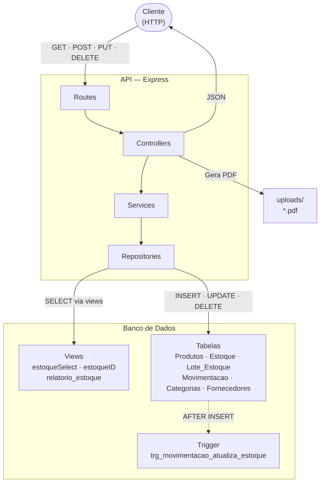
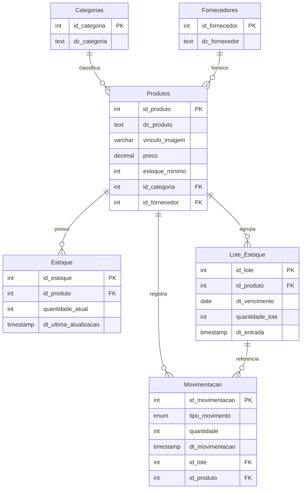
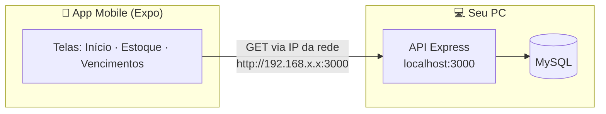
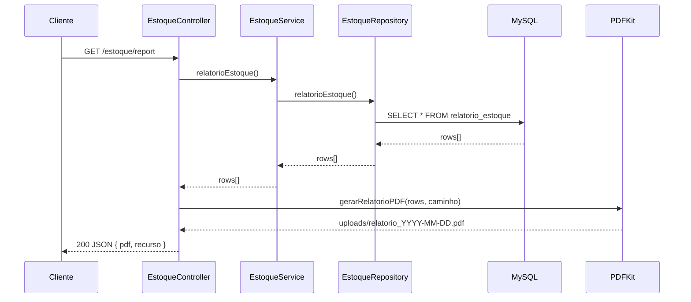

# StockPlus API

<div align="center">


[](https://sonarcloud.io/summary/new_code?id=rafafrd_StockPlus-Distribuidora)

</div>

---

## Contextualização

A empresa **StockPlus Distribuidora** atua no setor de **comercialização e distribuição de produtos variados para o varejo**. Com o crescimento do número de clientes e fornecedores, a empresa passou a lidar com um volume cada vez maior de produtos armazenados, tornando essencial um controle eficiente de estoque, entradas e saídas de mercadorias.

O sistema foi desenvolvido com foco em **Programação Orientada a Objetos (POO)**, arquitetura em camadas e padrões de projeto, visando organização, extensibilidade e facilidade de manutenção.

---

## Arquitetura



---

## Diagrama de Entidades



---

## Configuração e execução

### Pré-requisitos

- Node.js LTS
- MySQL 8+
- npm

### Instalação

```bash
npm install
```

### Variáveis de ambiente

Crie um arquivo `.env` na raiz do projeto:

```env
DB_HOST=localhost
DB_USER=root
DB_PASSWORD=sua_senha
DB_NAME=StockPlus_db
DB_PORT=3306
PORT=3000
```

### Banco de dados

Execute o script completo em seu cliente MySQL:

```bash
mysql -u root -p < docs/db.sql
```

> **Execute o arquivo inteiro.** Além das tabelas e da trigger, o script cria as views abaixo — sem elas, os endpoints de listagem e o relatório não funcionam:
>
> | View | Usada em |
> |---|---|
> | `estoqueSelect` | `GET /estoque` — listagem geral com status |
> | `estoqueID` | `GET /estoque/:id` — busca por ID |
> | `relatorio_estoque` | `GET /estoque/report` — relatório completo com PDF |

#### Seed inicial (dados de exemplo)

O arquivo `docs/db.sql` contém INSERTs comentados com 4 categorias, 4 fornecedores, 4 produtos, registros de estoque, lotes e movimentações prontos para teste.

Para popular o banco com esses dados, **descomente** o bloco correspondente antes de executar:

```sql
-- Descomente as linhas abaixo para ter dados iniciais:

INSERT INTO Categorias (dc_categoria) VALUES ('Bebidas'), ('Alimentos'), ...
INSERT INTO Fornecedores ...
INSERT INTO Produtos ...
INSERT INTO Estoque ...
-- Lote_Estoque e Movimentacao também disponíveis no arquivo
```

> Com o seed ativo, o endpoint `GET /estoque/report` já retorna dados reais e gera um PDF de exemplo.

---

## Scripts disponíveis

| Comando | O que faz |
|---|---|
| `npm run dev` | Compila o TypeScript, verifica o lint e — **somente se tudo passar** — inicia o servidor com hot-reload |
| `npm run start` | Inicia o servidor diretamente com nodemon, sem verificações prévias |
| `npm run build` | Apenas compila o TypeScript |
| `npm run lint` | Apenas verifica o lint com ESLint |

### Use `npm run dev` durante o desenvolvimento

```
--- [1/3] Compilando TypeScript...
✅ Build passou!
--- [2/3] Verificando lint...
✅ Lint passou!
--- [3/3] Iniciando servidor...
[nodemon] starting `ts-node ./src/server.ts`
```

Se build ou lint falharem, o servidor **não sobe** e o erro é exibido no terminal.

### Use `npm run start` quando quiser só executar

```bash
npm run start
```

Ideal para ambientes onde o código já foi validado previamente.

---

## Aplicativo Mobile

Foi adicionado um aplicativo mobile em **`mobile/`**, construído com **Expo + React Native (TypeScript)**, que **consome esta API**. Ele é apenas de leitura e oferece três telas: **Início** (visão geral), **Estoque Mínimo** (produtos críticos) e **Vencimentos** (lotes próximos do vencimento).



### Pré-requisitos

- Node.js LTS e npm
- A **API rodando** (`npm run dev` na raiz do projeto) com o banco já configurado
- Um celular com o app **Expo Go** instalado **ou** um emulador Android/iOS
- O celular/PC na **mesma rede Wi-Fi**

### Passo a passo

```bash
cd mobile
npm install
npm start        # abre o Metro/Expo com o QR Code
```

Depois, escaneie o QR Code com o app **Expo Go** (Android) ou a câmera (iOS). Atalhos: `npm run android` / `npm run ios` para abrir direto em um emulador.

### ⚠️ Importante: `localhost` no celular **não** aponta para o seu PC

Quando a API roda no seu computador, ela fica em `http://localhost:3000`. Mas **`localhost` (e `127.0.0.1`) sempre se refere ao próprio aparelho onde o código está rodando**. No celular, `localhost` é o *próprio celular* — não o seu PC. Por isso o app **não** consegue usar `localhost` para falar com a API.

A solução é apontar o app para o **IP da sua máquina na rede local** (ex.: `http://192.168.0.10:3000`). Para descobrir esse IP:

- **Windows:** rode `ipconfig` e use o **Endereço IPv4** do adaptador Wi-Fi (algo como `192.168.x.x`)
- **Linux/macOS:** `ip addr` ou `ifconfig`

| Onde o app roda | URL que alcança a API |
|---|---|
| Celular físico (Expo Go) | `http://SEU_IP_LOCAL:3000` (ex.: `http://192.168.0.10:3000`) |
| Emulador Android | `http://SEU_IP_LOCAL:3000` (ou `http://10.0.2.2:3000`) |
| Simulador iOS (mesmo Mac) | `http://localhost:3000` funciona |
| Expo Web (mesmo PC) | `http://localhost:3000` funciona |

### Onde configurar

Edite a constante `API_BASE_URL` em **`mobile/src/services/api.ts`** com o IP e a porta da API:

```ts
// mobile/src/services/api.ts
export const API_BASE_URL = 'http://192.168.0.10:3000'; // ← troque pelo IP da SUA máquina + porta da API
```

> A porta deve ser a mesma em que a API sobe (a do `.env`, ex.: `3000`). Garanta que a API esteja acessível na rede — em alguns casos o **firewall do Windows** pode bloquear a porta; libere-a se o app não conseguir conectar.

### Telas e endpoints consumidos

| Tela | Endpoint(s) da API |
|---|---|
| Início | `GET /estoque/report` + `GET /lote-estoque` (contadores) |
| Estoque Mínimo | `GET /estoque/report` (produto, categoria, qtd, mínimo) |
| Vencimentos | `GET /lote-estoque` + `GET /produtos` (nomes dos produtos) |

---

## Endpoints

### Categorias `/categorias`

| Método | Rota | Descrição |
|---|---|---|
| GET | `/categorias` | Lista todas |
| GET | `/categorias/:id` | Busca por ID |
| POST | `/categorias` | Cria nova |
| PUT | `/categorias/:id` | Atualiza |
| DELETE | `/categorias/:id` | Remove |

### Fornecedores `/fornecedores`

| Método | Rota | Descrição |
|---|---|---|
| GET | `/fornecedores` | Lista todos |
| GET | `/fornecedores/:id` | Busca por ID |
| POST | `/fornecedores` | Cria novo |
| PUT | `/fornecedores/:id` | Atualiza |
| DELETE | `/fornecedores/:id` | Remove |

### Produtos `/produtos`

| Método | Rota | Descrição |
|---|---|---|
| GET | `/produtos` | Lista todos |
| GET | `/produtos/:id` | Busca por ID |
| POST | `/produtos` | Cria novo (aceita imagem via `multipart/form-data`) |
| PUT | `/produtos/:id` | Atualiza |
| DELETE | `/produtos/:id` | Remove |

### Estoque `/estoque`

| Método | Rota | Descrição |
|---|---|---|
| GET | `/estoque` | Lista com status de estoque |
| GET | `/estoque/report` | Gera relatório completo em JSON + PDF |
| GET | `/estoque/:id` | Busca por ID |
| POST | `/estoque` | Cria registro |
| PUT | `/estoque/:id` | Atualiza quantidade |
| DELETE | `/estoque/:id` | Remove |

### Lotes de Estoque `/loteEstoque`

| Método | Rota | Descrição |
|---|---|---|
| GET | `/loteEstoque` | Lista todos com alertas de vencimento |
| GET | `/loteEstoque/:id` | Busca por ID |
| POST | `/loteEstoque` | Cria lote |
| PUT | `/loteEstoque/:id` | Atualiza lote |
| DELETE | `/loteEstoque/:id` | Remove lote |

### Movimentações `/movimentacao`

| Método | Rota | Descrição |
|---|---|---|
| GET | `/movimentacao` | Lista todas |
| GET | `/movimentacao/:id` | Busca por ID |
| POST | `/movimentacao` | Registra entrada ou saída |
| PUT | `/movimentacao/:id` | Atualiza |
| DELETE | `/movimentacao/:id` | Remove |

---

## Relatório de Estoque — `GET /estoque/report`

O endpoint retorna os dados do estoque em **JSON** e gera automaticamente um **PDF formatado** salvo em `uploads/`.

### Resposta JSON

```json
{
  "mensagem": "Relatório de estoque gerado com sucesso.",
  "pdf": "relatorio_2026-05-28.pdf",
  "recurso": [
    {
      "id_produto": 1,
      "dc_produto": "Coca-Cola",
      "preco": "5.99",
      "estoque_minimo": 10,
      "dc_categoria": "Bebidas",
      "dc_fornecedor": "Fornecedor A",
      "quantidade_atual": 0,
      "dt_ultima_atualizacao": "2026-05-28T...",
      "total_em_lotes": 100,
      "proximo_vencimento": "2026-01-31",
      "valor_total_estoque": "0.00",
      "status_estoque": "SEM_ESTOQUE"
    }
  ]
}
```

### PDF gerado

- **Nome:** `relatorio_YYYY-MM-DD.pdf` (sobrescreve o do mesmo dia)
- **Local:** `uploads/relatorio_YYYY-MM-DD.pdf`
- **Formato:** A4 landscape
- **Conteúdo:** tabela com produto, categoria, fornecedor, quantidade, estoque mínimo, lotes, próximo vencimento, valor total e status
- **Status colorido:** `NORMAL` em verde · `ESTOQUE_BAIXO` em laranja · `SEM_ESTOQUE` em vermelho
- **Rodapé:** valor total em estoque e contagem por status

### Fluxo do relatório



---

## Regras de negócio

- **Trigger automática:** toda `Movimentacao` do tipo `ENTRADA` soma à `quantidade_atual` em `Estoque`; `SAIDA` subtrai
- **Alertas de lote:** lotes com vencimento em até **45 dias** → `CRITICO`; até **90 dias** → `ATENÇÃO`
- **Status de estoque:** `quantidade_atual <= 0` → `SEM_ESTOQUE` · `quantidade_atual <= estoque_minimo` → `ESTOQUE_BAIXO` · caso contrário → `NORMAL`
- **Validação de IDs:** todos os endpoints que recebem ID (params ou body) rejeitam valores `NaN` ou negativos com `400`
- **Verificação de existência:** `PUT` e `DELETE` retornam `404` quando `affectedRows === 0`
