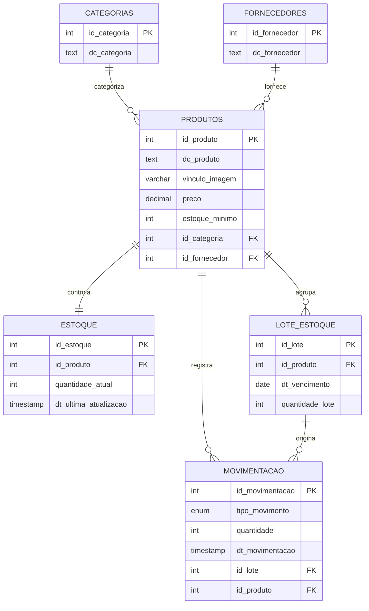

```mermaid
erDiagram
    CATEGORIAS ||--o{ PRODUTOS : "categoriza"
    FORNECEDORES ||--o{ PRODUTOS : "fornece"
    PRODUTOS ||--|| ESTOQUE : "controla"
    PRODUTOS ||--o{ LOTE_ESTOQUE : "agrupa"
    PRODUTOS ||--o{ MOVIMENTACAO : "registra"
    LOTE_ESTOQUE ||--o{ MOVIMENTACAO : "origina"

    CATEGORIAS {
        int id_categoria PK
        text dc_categoria
    }
    FORNECEDORES {
        int id_fornecedor PK
        text dc_fornecedor
    }
    PRODUTOS {
        int id_produto PK
        text dc_produto
        varchar vinculo_imagem
        decimal preco
        int estoque_minimo
        int id_categoria FK
        int id_fornecedor FK
    }
    ESTOQUE {
        int id_estoque PK
        int id_produto FK
        int quantidade_atual
        timestamp dt_ultima_atualizacao
    }
    LOTE_ESTOQUE {
        int id_lote PK
        int id_produto FK
        date dt_vencimento
        int quantidade_lote
    }
    MOVIMENTACAO {
        int id_movimentacao PK
        enum tipo_movimento
        int quantidade
        timestamp dt_movimentacao
        int id_lote FK
        int id_produto FK
    }
```
